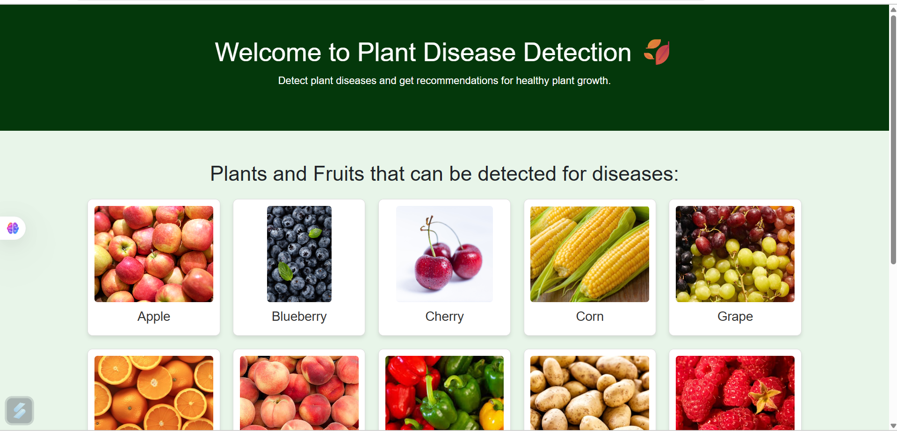

# 🌿 Plant Disease Predictor using Machine Learning & Deep Learning

Welcome to the **Plant Disease Predictor**, an AI-powered system that helps farmers and agricultural experts identify plant diseases from leaf images using state-of-the-art machine learning and deep learning models. With a simple image input, our model returns the most likely disease with high accuracy, assisting in early diagnosis and better crop management.

---

## 🚀 Project Highlights

- 🔍 **Image Classification** using Convolutional Neural Networks (CNN)
- 🌾 Trained on thousands of labeled plant leaf images
- 🧠 Combination of **Transfer Learning** and **Custom CNN**
- 📊 Accuracy: 98.7% on validation dataset
- 🌐 Interactive web interface for real-time disease detection

---

## 📸 Demo

### ✅ Upload a Leaf Image to Detect Disease

### ✅ Instant Disease Prediction Output

### ✅ Confidence Scores for Each Class

### ✅ Dashboard View with Prediction History

---

## 🧠 How It Works

1. **Image Preprocessing**: Resize, normalize, and augment leaf images.
2. **Model Architecture**: Built using Keras/TensorFlow:
   - Transfer Learning (e.g., ResNet50, EfficientNetB0)
   - Fine-tuned layers with Softmax output
3. **Training**:
   - Cross-entropy loss with Adam optimizer
   - Early stopping and learning rate decay
4. **Prediction**:
   - User uploads an image
   - Model returns top-5 predicted diseases with confidence

---

## 📂 Project Structure

